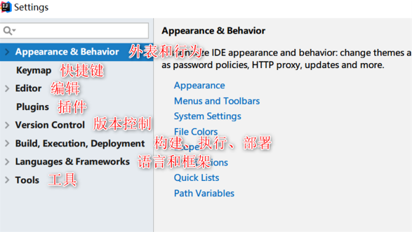
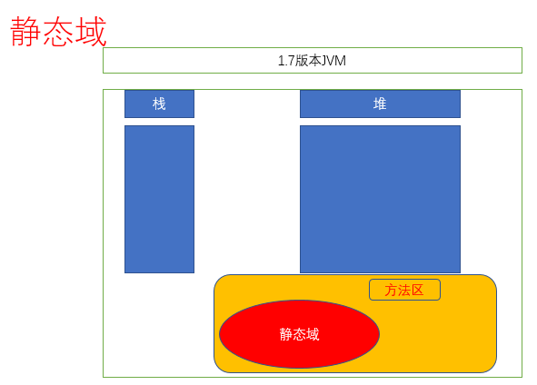
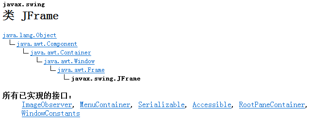
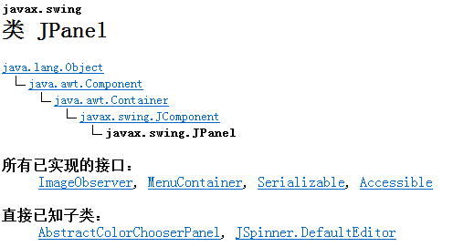
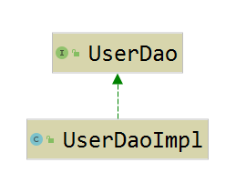
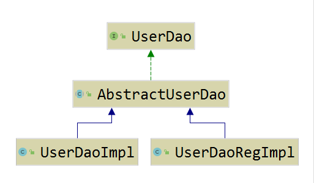

# 数组及页向对象

[TOC]

## IDEA设置及优化

### 常用的插件

## 数组及多维数组
### 数组的定义
>数组是一堆具有共性的对象的集合. 
>数组的长度一旦定义,不能改变. 
>数组的类型一旦确定,只能存放指定类型的数据. 

### 数组的声明方式

 1. 声明一个带有长度的数组

    > ~~~java
    > int is [] ;
    > is = new int[10];
    > int is1 [] = new int [20];
    > ~~~
    >
    > 上述两种方式本质是相同的.
    >
    > int数组的每一个值在未赋值时,默认值都是0.
    >
    > 引用变量数组的默认值应该是null..

 2. 声明数组直接赋值

    > ~~~java
    > int [] is = new int []{1,2,3,4,5,6};
    > ~~~
    >
    > 

### 多维数组

> java本身不支持多数组,它用多维数组(数组的数组)变相实现的多数组这个概念
>
> 

## 构造器

### 构造器的作用

> 构造器的作用是初始化变量.

## 修饰符

​	范围修饰符

| 修饰符    | 描述     | 访问范围                       |
| --------- | -------- | ------------------------------ |
| public    | 公共的   | 在项目里面的任何地方(所有包下) |
| protected | 受保护的 | 在本包及外包下的子类           |
| default   | 默认的   | 在本包下                       |
| private   | 私有的   | 只能在本类中访问               |

protected示例:

| Person:                                                      |
| ------------------------------------------------------------ |
| public class Person {          public String name;          public int age ;          protected String cardId; } |
| !                                                            |

~~~java
public class User extends Person {
    public static void main(String[] args) {
        User user = new User();
        user.cardId ="200";
    }
}
~~~

静态修饰符

​	static 由static修饰的成员的生命周期与普通成员的生命周期发生了改变.

​	static 的生成是随着JVM的创建.会随之创建一个Method方法区.在方法区内会开辟一个空间专门存放由static修改的成员.这个空间叫静态域.

​	也就是说,Java程序运行时,JVM创建了,静态变量也就创建了.

图示:

示例:

~~~java
public class User extends Person {
    public static void main(String[] args) {
        System.out.println(Person.name);
        System.out.println(Person1.name);
    }
}
~~~

### 方法的先入后出原则

在类中的方法调用时,它是在栈空间中调用.调用完后即销毁.

所以平常会说入栈及出栈这两个名词,这两个名词来表示方法的调用及销毁的过程.

在方法之间有调用关系时,遵循着先入后出的元则.

​	 

## 面向对象 

面向对象的特性有哪些?

​	所有的程序语言都有抽象的概念在里面,所以,面向对象的特性应该有抽象,封装,继承,多态.

java的面向对象的特性有哪些?

​	Java的特性是封装.继承.多态.	

### 封装

​	将数据的获取方式隐藏起来,提供公共访问方法.让可信的人员对数据进行操作.

​	简单来说的话,封装即隐藏.

​	封装的目的就是让数据的安全得到保证.

​	在实际开发中,对于封装的使用,主要应用在javaBean上.

​	示例:

~~~java
public class User {
   private String name;    
   private String pwd ;
   private int role ;
   /**getter/setter方法略*/
}
~~~

### 继承

​	子类继承父类的所有的非私有化属性及方法.

​	is a 

​	has a 

​	继承的目的就在于偷懒.为了实现代码的可重用性.

#### 通过JFrame类来理解继承的含义.

​	继承关系:

​		

#### JPanel类:

​	

​	

​	想去实现相应的内容,那么需要去重写paint方法.

​	示例:

~~~java
public void paint(Graphics g) {
    /**Graphics g 父类帮子类将画笔初始化好了.**/
    super.paint(g);
    /**设置画纸的背景颜色为黑色*/
    this.setBackground(Color.BLACK);
}
~~~

#### Graphics类

​	当前类是抽象类.帮助直接使用的实例是其子类Graphics2D的实例.

native 代表的意思是调用方法区内的本地方法.本地方法就是JVM根据不同的系统c或c++写好的方法与硬件进行交互. 目前不用考虑native执行的内容是什么.native涉及到的就是底层的代码.目前查看源码.至此就可以理解为,剩余的事情交由电脑自主执行.

### 匿名内部类

~~~java
new Thread(new Runnable() {
    @Override
    public void run() {
        for (int i = 0; i < 10; i++) {
            System.out.println("匿名内部类" + i);
        }
    }
}).start();
~~~

### 重构

​	重构并不是相关的设计思想.它是将之前的代码结构进行重新的梳理及对于代码耦合进行重新的设计.它对于当前程序的功能并无添加的功用.好处是对于对象耦合度的重新设计.

​	设计程序的核心思想是高内聚,低耦合.

图示:

​	原图:

​		

​	重构后:

​		

# 完成在图中画300个星星

