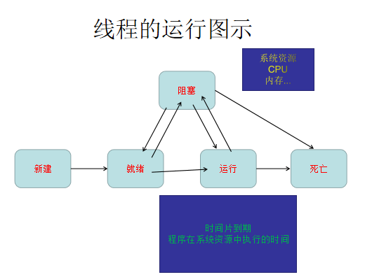

# 第5天学习内容 

[TOC]

## 开发流程

​	从一个项目搭建到项目上线,所需要的步骤:	

### 瀑布式开发:
​	OO:面向对象 

		1. OOA	面向对象分析
  		2. OOD    面向对象设计 
  		3. OOP    面向对象编程
  		4. OOT    面向对象测试
  		5. OOS/M  面向对象维护 

上述内容本质就是面向过程去实现的开发思路.

### 螺旋迭代开发

​	将整个一个项目划分成模块.每一个模块都是按照基础的瀑布式开发来完成相关模块的开发,最后将项目进行整合.		

图示:

​	

### ==原型开发==

​	UI(PS) 做出图形  --> 前端 (静态页面)  -->	项目开发(开发工程师/测试工程师)  -->项目线程(运维/实施)

## UML建模技术 

​	用图形来表示开发设计的语言.

​	当前语言是一种建立模型的工具.方便开发人员通过图形来了解程序的设计.模块的实现流程.

​	便于开发人员对于项目的认识及相互的交流.

​    用例图.类图.时序图...

​	需要通过文档将图示进行描述:

​		**需求分析说明书**`/`**数据库设计说明书**/时序是对某一个对象执行流程的时间节点.

## 线程

​		线程的目的是为了让一个程序在执行过程中能同时处理不同的事务.

​	一个Java的程序在执行时至少有两个线程,main线程(主线程),gc()垃圾回收器.

### ==线程的状态:==

  1. 新建  --  new

  2. 就绪  --  runnable

  3. 运行  --  running

  4. 阻塞  --  block

  5. 死亡  --  dead 

     人对线程可操作的状态只有==新建==/==就绪==.其余的,都是交由系统抢占资源而确定线程的执行顺序.

图示:

​	

线程在执行的过程当中是不可控的,执行的顺序是交由系统资源来分配.

	### ==线程的创建方式==

	1. 继承Thread类

~~~java
public class Thread1 extends Thread {
    /****
     * 线程在创建后需要执行的代码.
     */
    public void run() {
        for (int i = 0; i <10; i++) {
            System.out.println("Thread1.... run()..."+(i+1)+"次");
        }
    }
}
~~~

	2. 实现Runnable接口

~~~java
public class Thread2 implements Runnable {
    public void run() {
        System.out.println("Runnable... run()....");
    }
}
~~~

通过调用发现.Thread2并没有继承Thread类,所以不能直接通过Thread类来向上转型.

需要观看源码:

~~~java
public
class Thread implements Runnable {
    /* What will be run. */
    private Runnable target;
    public Thread(Runnable target) {
        //init(null, target, "Thread-" + nextThreadNum(), 0);
    }
}
~~~

测试代码:

~~~java
public class ThreadTest {
    public static void main(String[] args) {
        //新建一个线程
        Thread t1 = new Thread1();
        //让线程可运行.   ===   就绪
        t1.start();

        //向上转型成Runnable对象
        Runnable r = new Thread2 ();
        //再通过Runnable对象转成线程对象.
        Thread t2 = new Thread(r);
        //就绪
        t2.start();

    }
}
~~~

总结:

​	在开发过程当中,并不能保证哪些类是必须继承的类,如果有继承关系后,再在当前类中开辟线程,这种情况就法使用继承Thread类的方式来创建线程,所以说,继承Thread类实现的线程就有一定的局限性.所以在开发时,都是==采用的实现Runnable接口来开辟线程.==

问题:

​	在线程中run()方法与start()方法有什么区别?	

​	执行run()方法,只相当于调用了某一个类里面的普通方法,它并没有开辟线程.

​	执行start()方法,是开辟了一个线程.然后通过系统资源分配它执行的时间片到期,当执行方法时,执行的是run()里面的代码块.

测试所有的线程问题都需要Thread.sleep(xxx ms)来让程序运行的慢一些,以观察线程执行时的内部关系.

​	

## 内部类

​	按照类的定义.定义里面只应该有成员变量及成员方法.一说内部类,就是在类的里面再去创建类.当前结构也就破坏了一个类的整体结构.这是内部类所造成的影响.同样,内部类它可以类里面的一个私有化变量及方法直接调用.并能将结果返回给调用者.简单来说的话,也就是实现==闭包==的作用.

​	闭包就是访问私有化变量及局部变量的一种方式.

	### 普通内部类

​	

Person$Student类也就是代码中的==Person.Student==

在windows里面文件的命名是可以用==.==的.在内部类的设计时就考虑此问题,因而设计==$==为java编译后的==.==

内部类的产生,必须是堆空间中有了外部类的实例.才能将内部类的class进行实例化.

代码:

~~~java
public class Outer{
    public class Inner{}
}
~~~

测试:

~~~java
Outer outer  = new Outer();
Outer.Inner inner = outer.new Inner();
或
Outer.Inner inner = new Outer().new Inner();
~~~

### 静态内部类

代码:

~~~java
public class Outer{
    public static class Inner{}
}
~~~

测试:

~~~java
Outer.Inner inner = new Outer.Inner();
~~~

### 方法内部类

代码:

~~~java
public class Outer{
    public Outer say(){
        class Inner extends Outer{}
        return new Inner();
    }
}
~~~

测试:

~~~java
Outer outer = new Outer();
Outer say = outer.say(1,2,3);
~~~

### ==匿名内部类==

​		首先,接口是没有构造器的,也就意味着接口不能实例化.匿名内部类的使用,就是一个程序在执行的过程当中,只执行一次代码,而无重复性的调用这种场景时,通过模拟实例化接口的方式,将需要执行的代码直接写到接口的实现方法里面.从而达到一次执行代码的目的.

​	在开发时绝对会用到此场景,比如,监听当前网站访问人数/线程对于星星的下落/监听网站的访问量等等.这些代码或者需求,都是一次性.所以,用匿名内部类实现是最好的方式.

代码:

~~~java
new Thread(new Runnable() {
    public void run() {
        for (int i = 0; i < 10; i++) {
            Thread.sleep(10);//try略
            System.out.println("Thread$1..run()");
        }
    }
}).start();
~~~

### 1.8新特性: lamda表达式

​	lamda表达式就是对匿名内部类在1.8时创建出来的一种简写方式.

​	只是看起简洁一些,实现的思路没有发生任何改变.

示例:

~~~java
new Thread(()->{
    for (int i = 0; i < 10; i++) {
        Thread.sleep(10);
        System.out.println("lamda...." + (i + 1));
    }
}).start();
~~~

## 项目的创建

300星星在项目中体现的作用:

### 需求分析说明书

> 1. 引言	
>
>    ​	1.1.1编写目的
>
>    ​	1.1.2背景
>
>    ​	1.1.3参考资料
>
> 2. 项目结构图(ER图)
>
>    项目需求整体功能的实现图应对的场景是和==用户==进行交流,确定整体功能的实体图.
>
> 3. 需求分析模块划分(用例图)==开发人员==
>
>    用例分析有一个粒度划分的概念.(粒度所指就是当前划分模块的大小)
>
>    以登陆模块为例.本身登陆模块就可以看成是一个粒度.但在开发过程当中,涉及到用户的登陆还包括用户的注册,如果注册再细分还会分为用户注册及管理员注册.
>
>    模块划分的不是越大越好,也不是越小越好,而在整个项目当中,划分的模块大概在8~30个之间.当前的数量是根据项目的难易程度进行的划分.
>
>    用例与用例之间可以有==扩展/依赖==两种关系.
>
>    根据分析的结果画出用例图并展现在需求分析当中.
>
> 4. 用例分析
>
>    对于某一个模块实现的思路,文字化的表述.保证任意一个程序员看到当前的文档描述,在功能的实现上,都有一个直观的了解.
>
>    ​	前置条件   --->当前执行的前提   ==示例:==
>
>    ​															 ---> 用户打开主页,点击右上角的登陆按钮,跳转到登陆页面.
>
>    ​															 --->在任意的商品购买页面,未登陆用户点击购买后,跳转到登陆页面.
>
>    ​	执行流		--->1.选择用户的输入栏,并获取焦点.
>
>    ​						--->2.用户输入用户名.
>
>    ​						--->3.选择用户的密码输入样,并获取焦点.
>
>    ​						---->4.用户输入密码.
>
>    ​						---->5.用户点击登陆按钮.
>
>    ​	后置条件	---->执行后的结果	示例:
>
>    ​														        --->程序执行流1:
>
>    ​																			后台获取到页面中的用户名和密码,从数据库查询是否有当前用户的信息.如果有信息,获取出来,与页面获取的数据进行密码的比对,如果说,密码也正确.跳转到登陆页面.
>
>    ​																---->程序执行流2:
>
>    ​																			后台获取到页面中的用户名和密码,从数据库查询是否有当前用户的信息.如果没有信息,(代表当前用户不存在).跳转到用户注册的页面,让用户注册信息.
>
>    ​											     返回原登陆前页面.

## 监听器

​	监听器就是在监听的组件上,产生了对应的动作后,而去执行预定好的代码.

​	监听源

​	监听实现

​	Listener

#### MouseListener 鼠标监听器   (接口)

​	

### 监听器的调用:

 1. 实现MouseListener接口,实现重写接口的方法.

    ~~~java
    public void mouseClicked(MouseEvent e) {
        System.out.println("mouseClicked()....");
    }
    
    public void mousePressed(MouseEvent e) {
        System.out.println("mousePressed()....");
    }
    
    public void mouseReleased(MouseEvent e) {
        System.out.println("mouseReleased()....");
    }
    
    public void mouseEntered(MouseEvent e) {
        System.out.println("mouseEntered()....");
    }
    
    public void mouseExited(MouseEvent e) {
        System.out.println("mouseExited()....");
    }
    ~~~

 2. 启动监听器.

    ​	找到监听源(要哪个组件监听(Compernent),当前只有GameFarme本身this)	

    ​	监听的对象(因为本身实现了MouseListener接口,所以本身就是一个监听对象)

    ​	

知识点:

​	大小及位置的知识点

​	监听器的知识点

​	字体的知识点

​	JButton知识点

### 当前项目的需求分析

​	飞机大战:

​		从窗体的大小及位置进行相应的设定.

​		

​	

​	

