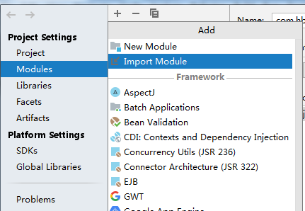
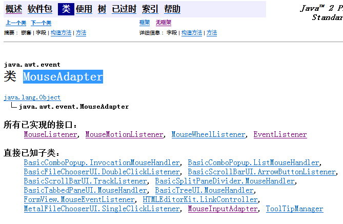
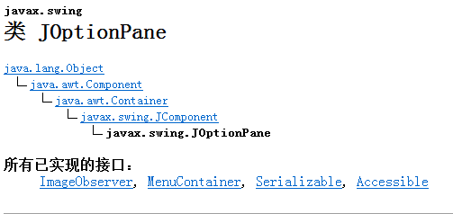

# 第6天学习内容 

[TOC]

## GIT

> 	1. 下载git并安装
>  	2. 配置git
>       	1. 配置用户名及邮箱

## GITEE相关配置

> 配置GITEE是为了和IDEA进行关联.
>
> 	1. 配置GIT信息
>  	2. 配置GITEE插件 (在plugins里面添加GITEE插件) 

## 项目的加载 

> 1. 获取到项目的地址,
> 2. 创建一个from version control的项目
>    1. 填写项目的地址
>    2. 可以修改项目的名称 

## 模块的复制

## 实现打砖块的游戏

> 1. 创建出游戏的窗体
>
> 2. 创建出游戏的画板
>
>    1. 在画板中添加档板
>
>       a. 添加鼠标动作监听器,以对档板对象进行控制.(X坐标发生改变)
>
>    2. 在画板中添加小球
>
>    3. 实现小球的运行
>
>    4. 实现小球与档板接触后反弹,不接触游戏结束

### JButton知识点

​	创建三个按钮,交由画板来添加.

## MouseMotionListener鼠标动作监听器:

源码:

~~~java
public interface MouseMotionListener extends EventListener {
    public void mouseDragged(MouseEvent e);
    public void mouseMoved(MouseEvent e);

}
~~~

### MouseAdapter抽象类

​		MouseAdapter类实现的接口有MouseListener及MouseMotionListener.所以抽象方法都进行了实现.

​	在监听器监听动作(对应的方法)时,需要注意,当前本身的监听器是否有对应的监听方法.

==实现MouseAdapter实例必须与添加的监听器动作一致才可以调用==

### MouseEvent类

> 包含着鼠标的当前的坐标.

### JOptionPanel类

## 创建小球

 1. 创建自己的主球,

 2. 让球跟着鼠标进行相应的移动

    a. 添加鼠标动作监听器,让球不论是拖动还是移动都跟着鼠标移动.

    

 3. 生成小球

