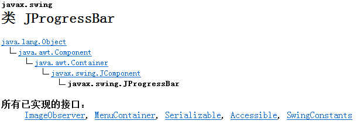
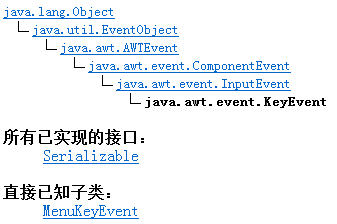

# day07的内容

[TOC]

## 进度条JProgressBar

## KeyListener键盘监听器

### keyPressed

​	键盘按下  应对着所有的键位.

### keyTyped

​	键盘按下  只应对着有unicode字符的键位.

### keyReleased

​	键盘抬起

### KeyEvent

​	键盘事件响应时,对应的事件对象,其内包含着按的键位的一系列操作.

## 图像的添加

### Image 图片对象 

​	图片对象是无法直接实例化的.

​	只能通过==ImageIcon==类的对象调用==getImage()==方法来获取对象.

### ImageIcon类

​	当前ImageIocn类有一个构造器,可以将字符串内容的路径转换一张Icon对象.

## 敌机的生成

创建对应的实际项目模块:

​	com.hblg.game

